MonkeyType Helpers
---

Description
---
This repo contains a few snippets that allow one to use apply MonkeyType onto modules within PyCharm by using the ExternalTools functionality within PyCharm.

Purpose
---
This was created in order to quickly be able to perform the following:
1) Infer and add types/annotations onto methods that are not typed properly
   - **Note**: I currently don't know how to use stubs to generate patches to apply, if someone knows, please do leave a comment, so I can apply it :)!
2) Use the recently generated/corrected types/signature to create patches to apply in order to reformat docstrs for methods

Walkthrough of Setup
---

#### Will be updated with text later

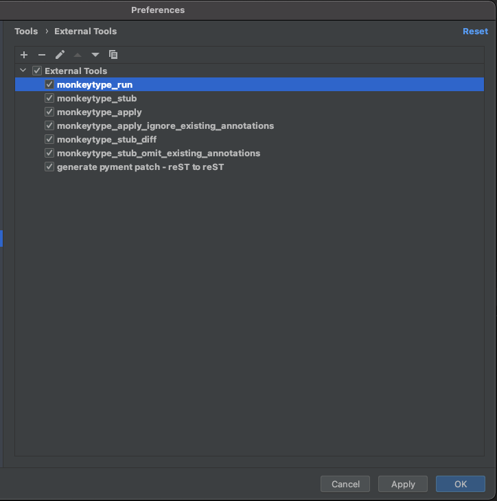
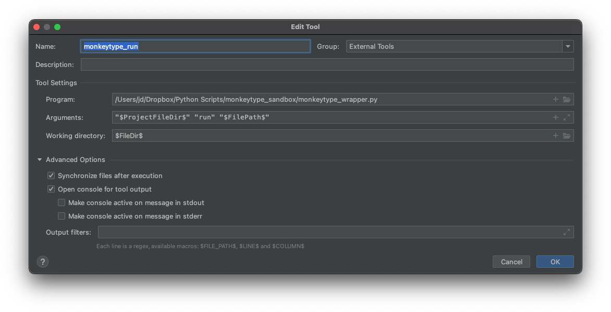

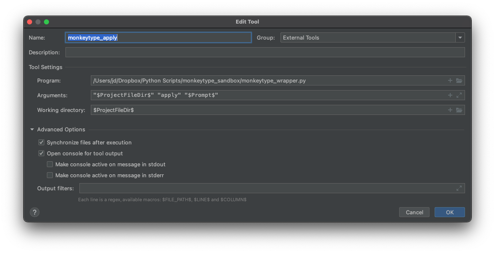

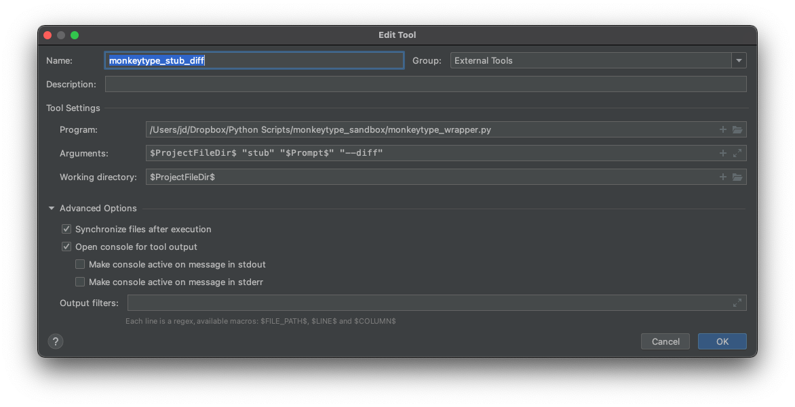
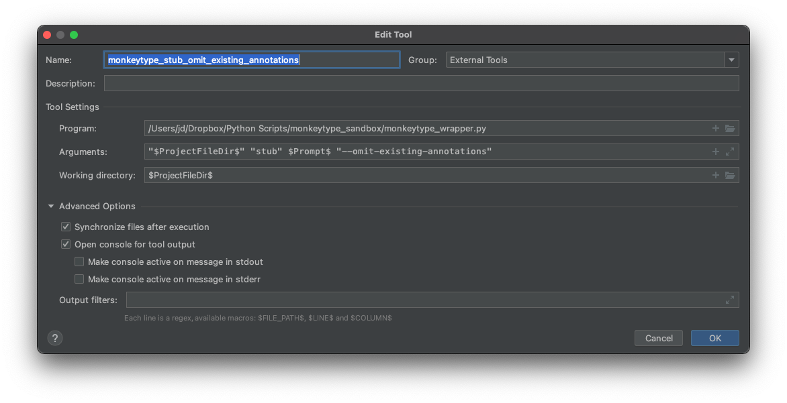
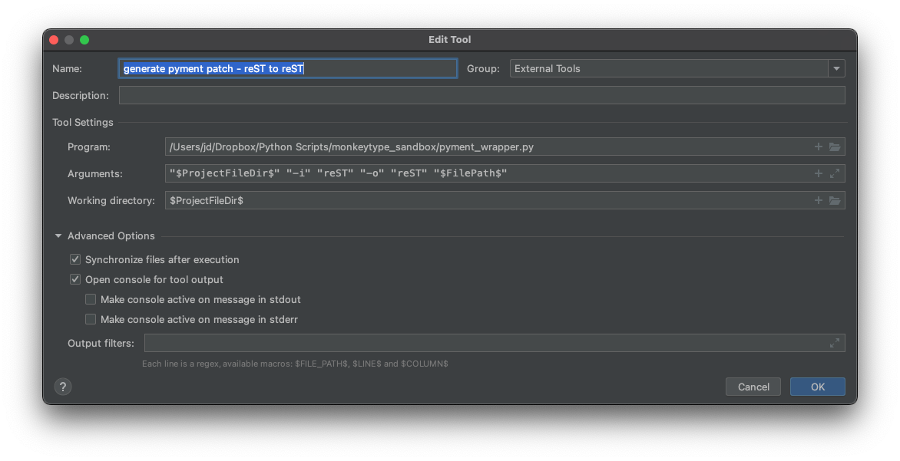
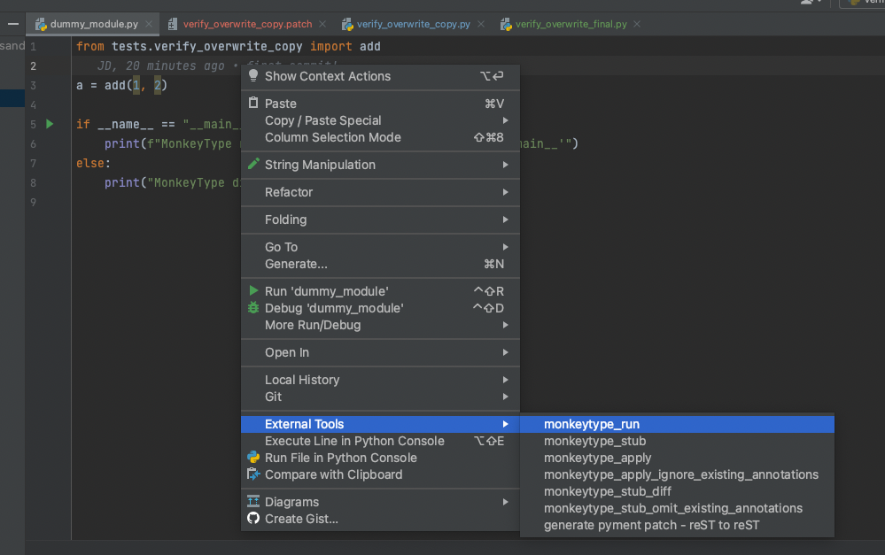
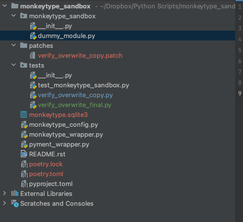
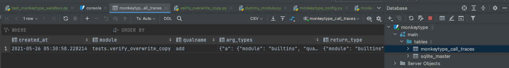
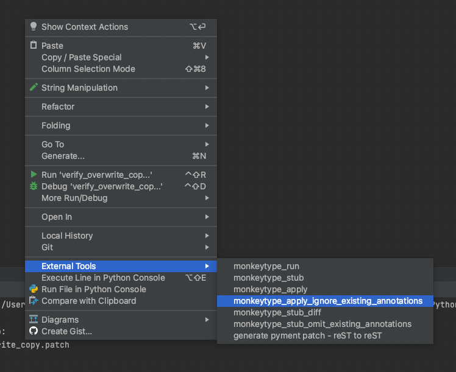
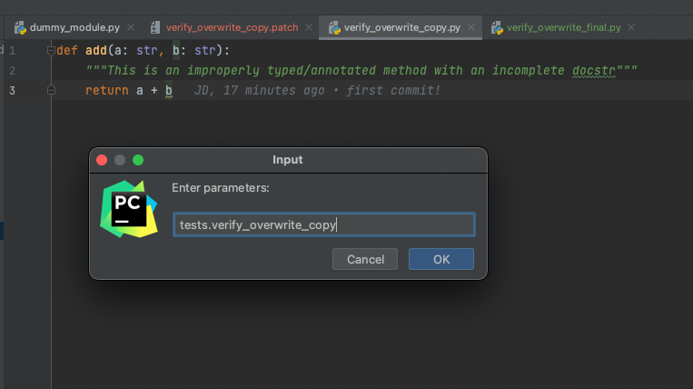
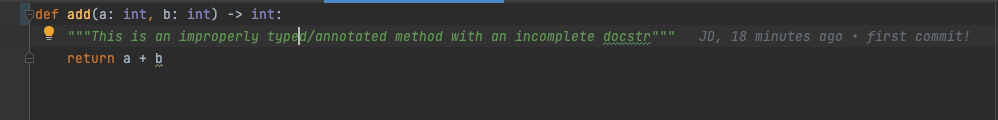
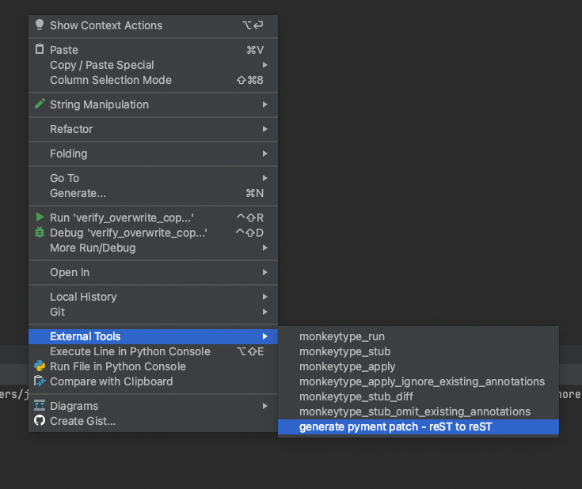
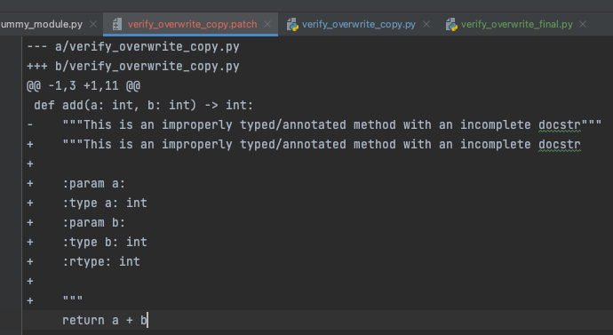
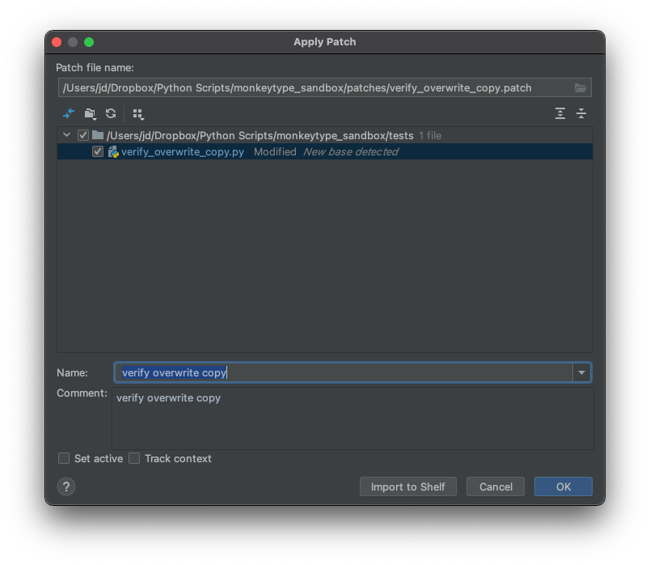
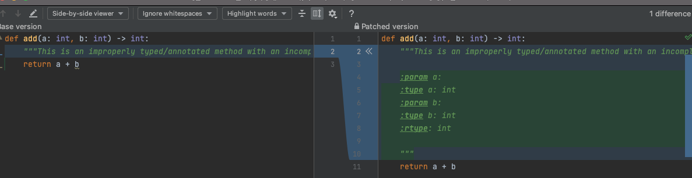
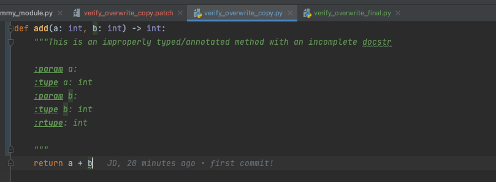
