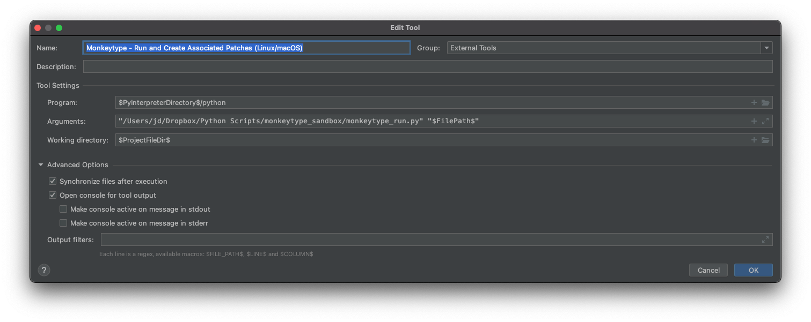
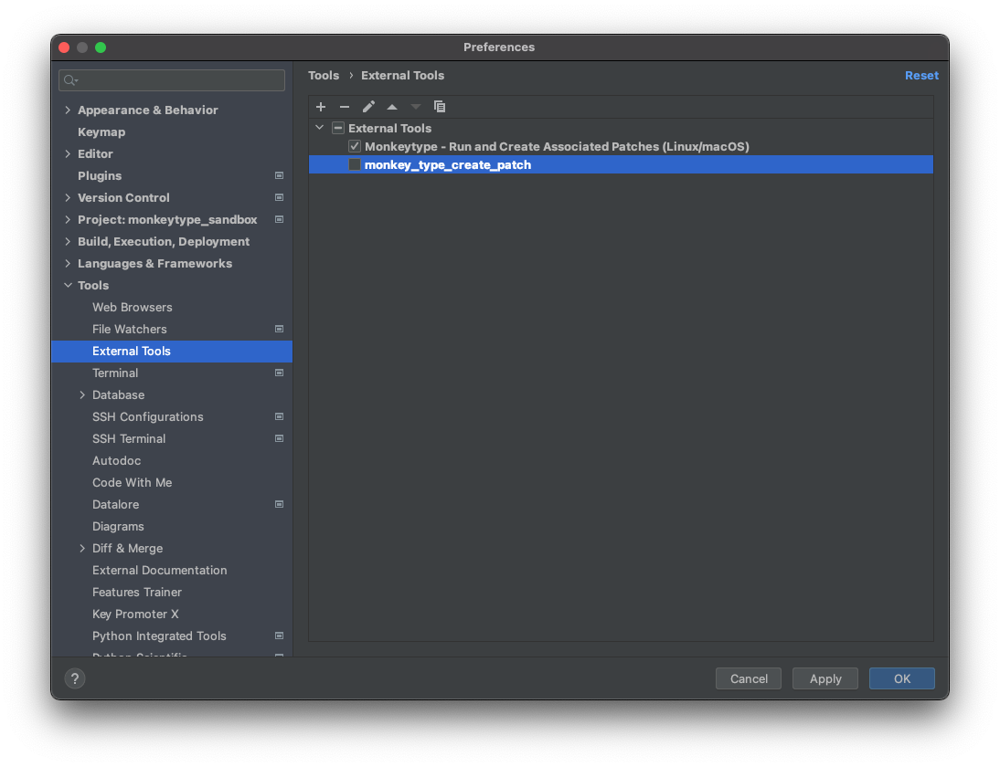
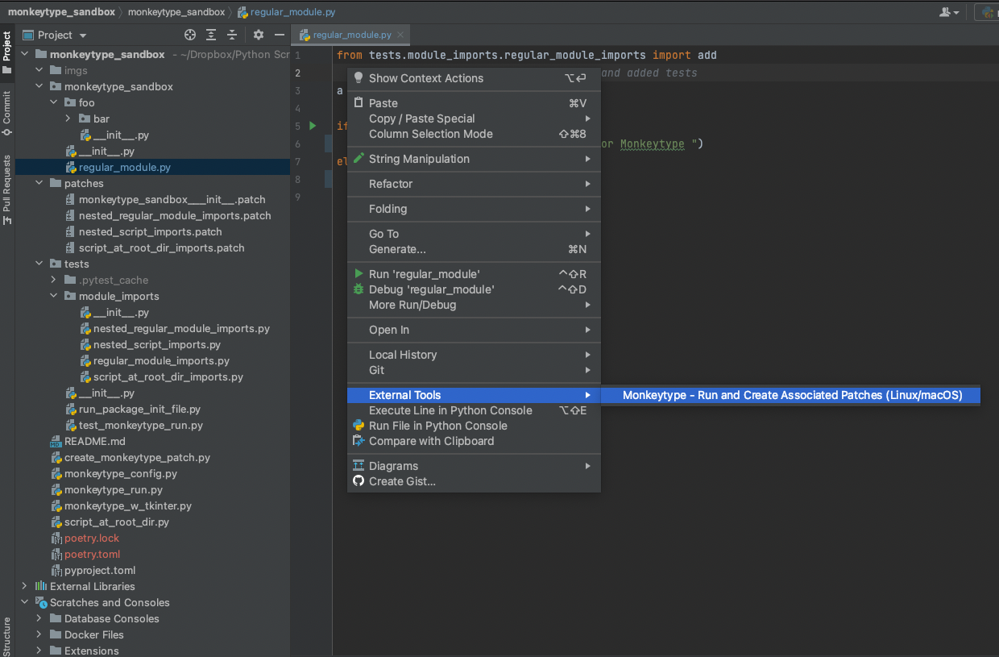
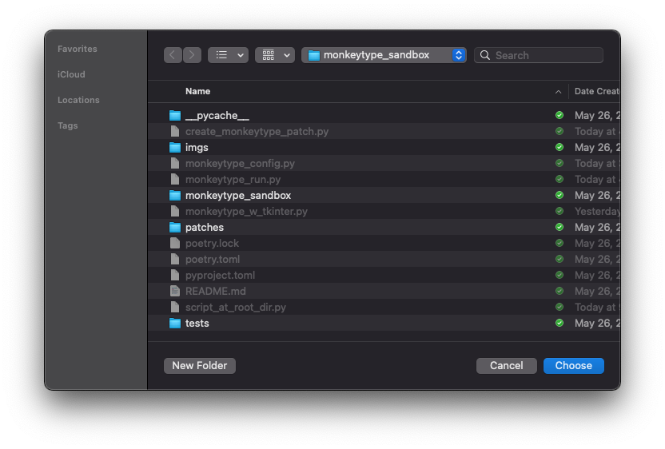
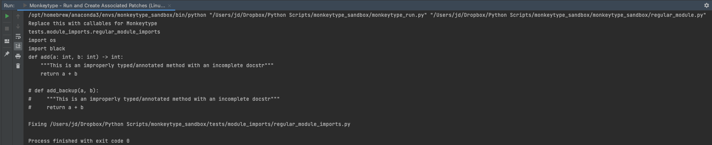
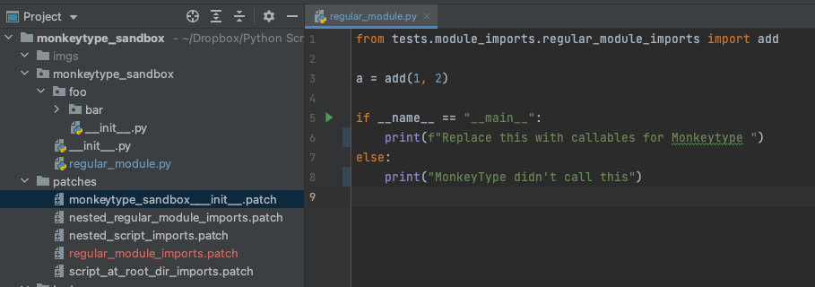
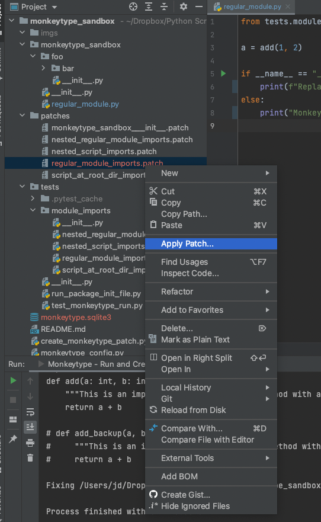
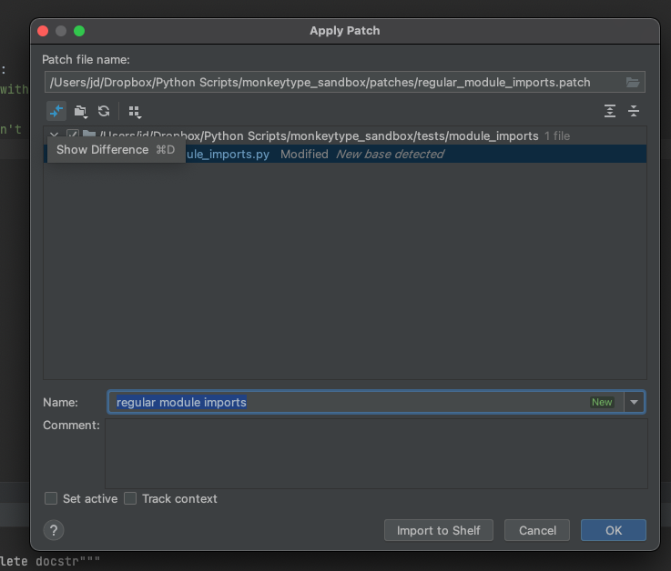
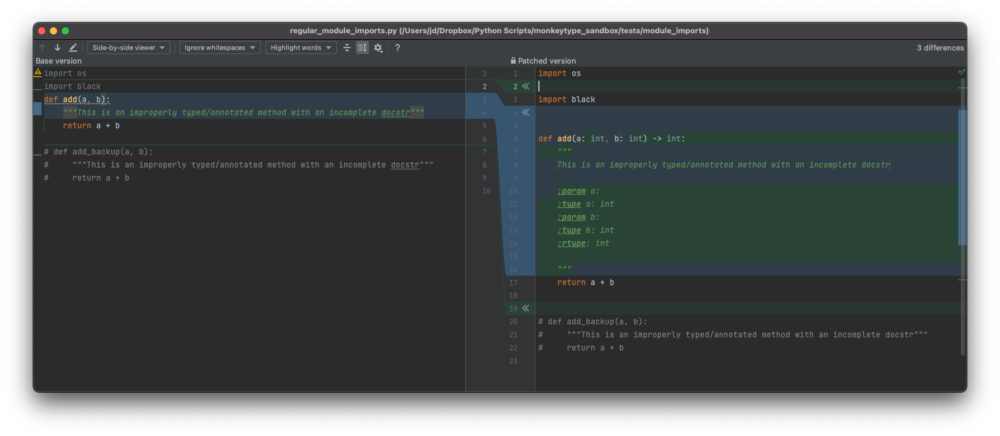

MonkeyType Helpers
---

Description
---
This repo contains a few snippets that allow one to use apply MonkeyType onto modules within PyCharm by using the ExternalTools functionality within PyCharm.

Purpose
---
This was created in order to quickly be able to perform the following:
1) Infer and add types/annotations onto methods that are not typed properly
   - **Note**: I currently don't know how to use stubs to generate patches to apply, if someone knows, please do leave a comment, so I can apply it :)!
2) Use the recently generated/corrected types/signature to create patches to apply in order to reformat docstrs for methods

Walkthrough of Setup
---
1) Clone repo
2) Install the following dependencies:
   - monkeytype
   - black
   - isort
   - pyment (use the github version since the pypi version isn't updated)
   - pytest
3) Follow steps in images below

4) ### Create a PyCharm External Tool (*Might differ for PCs*)
   
   -  *Note, you can hard-code to a specific interpreter, but make sure that that interpreter contains all dependencies found on the script you are running the external tool on*
   -  *In this example, the script path is hard-coded*
   

5) ### Right-Click and Run External Tool on Module of Interest
   

6) ### Select Project Directory the script is a part of (this will contain your monkeytype.sqlite3 db, and your script/package/module must be found somewhere (nested or not) in this folder)
   
   
   
   -  *Example output shown above*
   
   
   -  *Patch for import dependency shown in red on left panel above*

7) ### Right-Click on Patch, Select Apply Patch
   

8) ### Select File to Patch and Click on Show Difference
   

9) ### Merge Desired Changes =)
   

